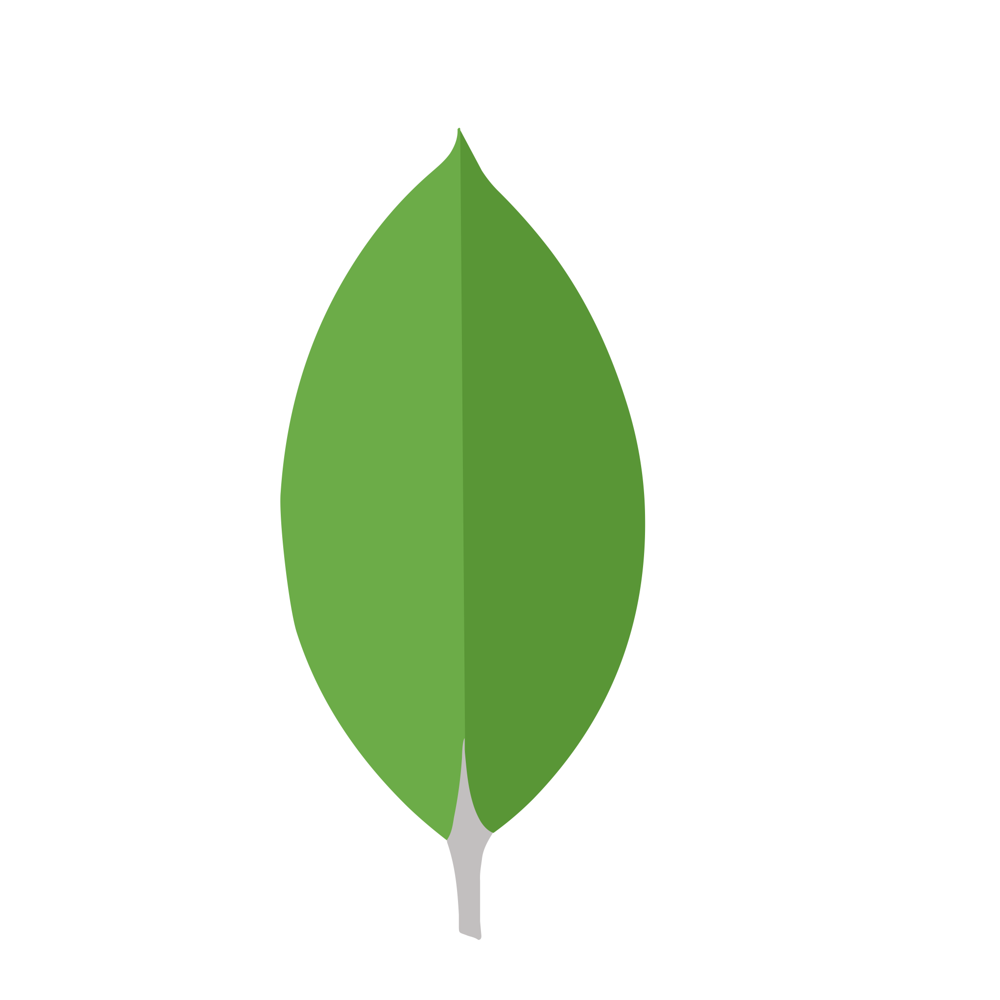

### Hi 👋, I am a software engineer working in Dhaka, Bangladesh
___

<!--
**tohirRaihan/tohirRaihan** is a ✨ _special_ ✨ repository because its `README.md` (this file) appears on your GitHub profile.

Here are some ideas to get you started:

- 🔭 I’m currently working on ...
- 🌱 I’m currently learning ...
- 👯 I’m looking to collaborate on ...
- 🤔 I’m looking for help with ...
- 💬 Ask me about ...
- 📫 How to reach me: ...
- 😄 Pronouns: ...
- ⚡ Fun fact: ...
-->

#### Now

<!-- - ✨ Contributing to [chkware](https://github.com/chkware/cli); -->
- :fire: Interested in Full Stack Development;
- :calendar: Looking for contributing to php and nodejs based open source projects 

#### Bio

- 🏢 I'm currently working at **IT CORNER**
- ⚙️ I use daily: `.php`, `.js`, `.cpp`
- 🌍 I'm mostly active within the **php & javaScript Community**
- 🌱 Learning all about **Full Stack Development**
- 💬 Ping me about **Laravel**, **React**, **Node.js**, **php & js**, **RestAPIs**
- 📫 Reach me: [linkedin.com/in/tohirraihan](https://www.linkedin.com/in/tohirraihan/)
- 📝 Checkout my [Resume](files/resume.pdf).

#### My Current Stack:

 &nbsp; &nbsp; &nbsp; &nbsp; &nbsp; &nbsp;

#### Development Stuffs:

<b>⚡ Github Stats</b>

     
    

#### Connect with me!

